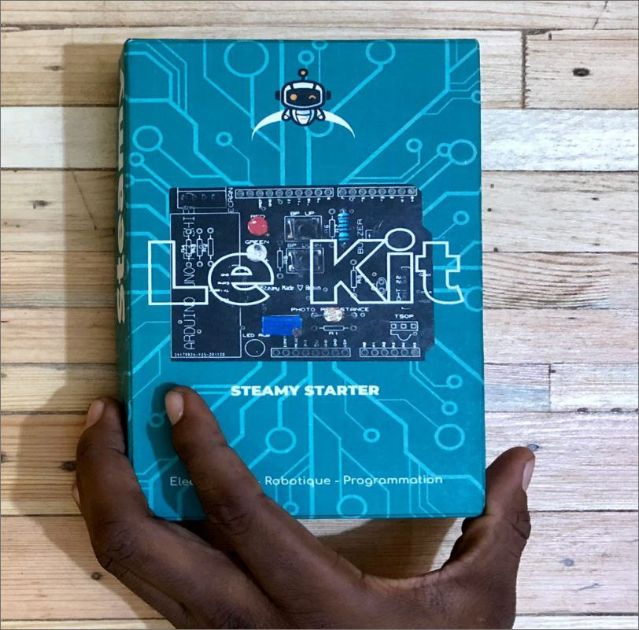

# Projet Steamy: Conception d’un robot Contrôleur statique

## Sommaire

- [A- Présentation du projet](#A-Présentation-du-projet)
- [B- Matériels nécessaires](#B-Matériels-nécessaires)
- [C- Installation et configuration](#C-Installation-et-configuration)
- [D- Fonctionnement du code](#D-Fonctionnement-du-code)
- [E- Procédure d'utilisation](#E-Procédure-d'utilisation)

---

## A- Présentation du projet

### a. Objectif du projet
L'objectif de ce projet est de concevoir un système intelligent utilisant le kit "STEAMY Starter". Ce système agit comme un contrôleur statique, capable de surveiller et d'informer sur l'état d'un laboratoire en temps réel.

### b. Contexte d’utilisation
Le système est conçu pour être utilisé dans un laboratoire où il surveille l'environnement et régule le comportement des opérateurs en fonction de diverses conditions.

### c. Résumé du fonctionnement
Le système démarre avec un appui sur le bouton poussoir BP1. Une fois en marche, le bouton BP1 est utilisé pour acquitter les défauts après leur résolution.

---

## B- Matériels nécessaires

### a. Composants et utilités

- **Steamy starter** : Ensemble de carte Arduino Uno et d’un shield Arduino Uno.
  

- **Capteur d’ultrasons** : Il mesure la distance d’un obstacle et avertit l’opérateur avec des signaux lumineux.
  

- **Capteur d’humidité** : Détecte la présence d'eau dans le laboratoire.
  

- **Ecran LCD** : Affiche des messages en temps réel sur l'état du système.
  

- **Télécommande IR** : Permet de déclencher des jeux de lumières sur la LED RGB en cas de défaut prolongé.

  

- **Les LEDs** :  servent à indiquer l’état du système

  

- **La led RGB** :   indique la distance de l’obstacle détecté par le capteur ultrason en 
changeant de couleur (vert, orange, rouge)

  

- **Le buzzer** :  Il émet un son pour alerter l’opérateur lorsqu'un problème persiste pendant plus de 3 minutes
sans être résolu.

 

- **Boutton poussoir** :  Ils permettent à l’opérateur d’interagir avec le système

  
  

### b. Outil logiciel
Pour ce projet nous utiliserons l’IDE Arduino. C’est une application multiplateforme qui est écrite dans des fonctions de C et C++. Il est utilisé pour écrire et télécharger des programmes sur des cartes compatibles Arduino. Il fournit plusieurs bibliothèques sous forme de classes (programmation orienté objet) qui sont utilisées notamment pour les différents capteurs et modules compatibles avec Arduino. Il utilise le programme avrdude pour convertir le code exécutable en un fichier texte au codage hexadécimal qui est chargé dans la carte Arduino par un programme de chargement dans le firmware de la carte.
Téléchargez et installez à l’adresse web [ici](https://www.arduino.cc/en/software) 
* N.B. : Veuillez à télécharger et installer l'IDE Arduino compatible avec votre système 
d'exploitation
Après installation vous devrez obtenues l’interface suivante

---

## C- Installation et configuration

### a. Montage physique
Le Shield facilite le montage, il relie les différents composants du circuit aux pins associés sur la carte Arduino.

### b. Configuration logicielle
Des bibliothèques comme `LiquidCrystal_I2C`, `DHT`, et `IRremote` sont nécessaires pour le bon fonctionnement du programme.

---

## D- Fonctionnement du code

Le programme qui gouverne ce système peut être subdivisé en trois parties essentielles. Un programme Arduino est constitué de deux fonctions indispensables setup et loop. Mais avant cela il faut définir certains éléments. Nous commençons donc par établir les données de base:

La seconde étape importante est la conception de la fonction setup(). On y retrouve toutes les configurations de bases du programme.

La troisième étape est la conception de la fonction loop() qui est une boucle infinie. Elle est ici constituée de deux principales boucles qui ne peuvent s’exécuter qu’après que la variable 11BP1 passe à l’état bas. La première boucle présentée ici-bas ré exécute la fonction system_good() qui présente toutes les caractéristiques du système en bonne fonction avec les conditions de redémarrage et d’arrêt.

La deuxième partie de cette dernière étape est également une boucle qui s’exécute dans les cas relatifs aux défauts

Le programme entier est constitué de plusieurs fonctions qui interagissent dans la fonction 
loop pour la bonne marche du système.

---

## E- Procédure d'utilisation

### 1. Démarrage du système
Le système est activé par un appui sur le bouton poussoir BP1.

### 2. Détection des défauts
Des capteurs détectent les obstacles et signalent les défauts via des LEDs et un écran LCD.

### 3. Gestion des obstacles
Le capteur ultrason mesure la distance à un obstacle et change la couleur de la LED RGB en fonction de la distance :
  
- Vert pour 32-40 cm
- Orange pour 22-32 cm
- Rouge pour moins de 22 cm

### 4. Alertes en cas de défaut prolongé
Si un défaut n'est pas résolu en 3 minutes, le buzzer retentit et des signaux lumineux sont déclenchés.

### 5. Redémarrage et arrêt du système
Un appui long sur BP2 permet d'éteindre complètement le système.

---

## Résultat attendu
Une fois en marche, la LED verte indique que le système fonctionne sans problème et l'écran affiche Pret !.

Pour avoir plus d'informations sur Techitall [Visiter TIA](https://techitall.co)

